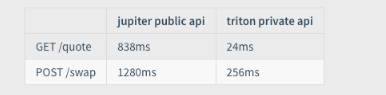

# 询价

市面上提供了各种询价api，这是判断是否有利差的重要步骤，快速、时效性是关键的。

jupiter的api太慢

trition也有询价api，很贵，2000美元

一般的询价都有有缓存，所以获取的价格未必是最新的。

# 空投

一些信息地址
AirdropAlert (https://airdropalert.com/)
Airdrops.io (https://airdrops.io/)
CoinMarketCap Airdrops (https://coinmarketcap.com/airdrops/)
CryptoDrop (Telegram 社区和 Discord 频道)